# Mercado Express — Aplicação Web (Spring MVC + Thymeleaf)

**FIAP — Análise e Desenvolvimento de Sistemas (TDS)**
**Checkpoint 4 — Parte II (MVC e Deploy)** · Professor: Dr. Marcel Stefan Wagner

Aplicação web server-side de um mercado de bairro. Uma **vitrine pública**, aberta a
qualquer visitante, e um **painel administrativo** protegido por login, onde o
administrador faz o CRUD completo dos produtos.

Não é a API REST da Parte I com uma tela por cima: é uma aplicação nova e independente,
sem `@RestController` e sem HATEOAS. Aqui o servidor devolve HTML renderizado com
Thymeleaf. O que veio da Parte I foi a modelagem do domínio — entidade, repository e a
ideia da camada de serviço — e o banco Oracle, que é o mesmo.

> 🔗 **Aplicação publicada:** https://mercadoexpress-mvc.onrender.com
> 🎥 **Vídeo de demonstração:** [PREENCHER LINK DO VÍDEO]
> 📦 **Parte I (API REST):** https://github.com/olavoneves/mercadoexpress-api
> 📦 **Parte II (este repositório):** https://github.com/olavoneves/mercadoexpress-mvc
>
> ⏱️ O plano gratuito do Render hiberna o serviço após 15 minutos sem acesso.
> O primeiro carregamento pode levar cerca de **50 segundos** enquanto o container
> sobe; os acessos seguintes são imediatos.

---

## Sumário

1. [O que a aplicação faz](#1-o-que-a-aplicação-faz)
2. [Tecnologias](#2-tecnologias)
3. [Arquitetura](#3-arquitetura)
4. [Mapa de rotas: público × privado](#4-mapa-de-rotas-público--privado)
5. [Spring Security](#5-spring-security)
6. [Credenciais de teste](#6-credenciais-de-teste)
7. [Modelo de dados](#7-modelo-de-dados)
8. [Como rodar localmente](#8-como-rodar-localmente)
9. [O CRUD na interface web](#9-o-crud-na-interface-web)
10. [Validação de formulários](#10-validação-de-formulários)
11. [Decisões de design](#11-decisões-de-design)
12. [Deploy](#12-deploy)
13. [Integrantes](#13-integrantes)

---

## 1. O que a aplicação faz

| Para o visitante | Para o administrador |
|---|---|
| Ver o catálogo de produtos em grade | Ver todos os produtos numa tabela densa e paginada |
| Buscar produto pelo nome | Buscar e filtrar por setor |
| Filtrar por setor | Cadastrar produto |
| Abrir a ficha completa de um produto | Editar produto |
| Fazer login | Excluir produto, com confirmação |

O visitante enxerga apenas produtos **ativos**. O painel enxerga tudo, inclusive o que
foi tirado da vitrine sem ser apagado do banco.

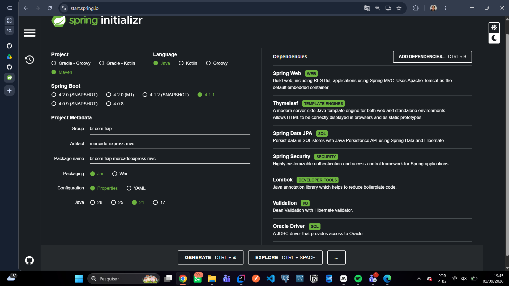

*Geração do projeto no Spring Initializr: Maven, Java 21, Spring Boot 4.1.1 e as
dependências da Parte II — Spring Web, **Thymeleaf**, Spring Data JPA, **Spring Security**,
**Lombok**, Validation e Oracle Driver.*

---

## 2. Tecnologias

| Camada | Tecnologia |
|---|---|
| Linguagem | Java 21 |
| Framework | Spring Boot 4.1.1 |
| Web | Spring MVC (server-side rendering) |
| Template engine | **Thymeleaf** + `thymeleaf-extras-springsecurity6` |
| Segurança | **Spring Security** (form login, BCrypt, CSRF) |
| Persistência | Spring Data JPA / Hibernate |
| Banco | **Oracle** (`oracle.fiap.com.br`) — o mesmo da Parte I |
| Banco de fallback | H2 em memória (perfil `dev`) |
| Validação | Bean Validation (Jakarta Validation) |
| Boilerplate | **Lombok** |
| Front-end | CSS próprio, sem framework (`static/css/app.css`) |
| Build | Maven |
| Deploy | Render (Docker) |
| IDE | IntelliJ IDEA |

---

## 3. Arquitetura

Fluxo clássico de MVC em camadas: o controller cuida só do HTTP e do `Model`, o service
concentra a regra de negócio, o repository fala com o banco e o Thymeleaf renderiza o HTML.

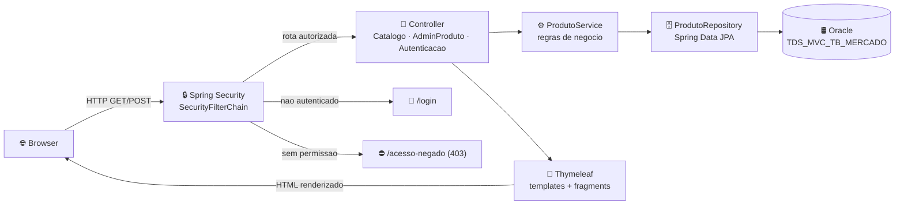

### Estrutura de pastas

```
src/main/java/br/com/fiap/mercadoexpress/mvc/
├── MercadoExpressMvcApplication.java
├── config/
│   └── SecurityConfig.java              # rotas públicas × privadas, usuários, BCrypt
├── controller/
│   ├── CatalogoController.java          # /            /produtos/{id}
│   ├── AdminProdutoController.java      # /admin/**    (CRUD completo)
│   ├── AutenticacaoController.java      # /login       /acesso-negado
│   └── TratadorDeErros.java             # @ControllerAdvice → página 404
├── exception/
│   └── ProdutoNaoEncontradoException.java
├── model/
│   ├── Produto.java                     # entidade + Bean Validation
│   └── SimNaoConverter.java             # Boolean ⇄ CHAR(1) 'S'/'N'
├── repository/
│   └── ProdutoRepository.java
└── service/
    └── ProdutoService.java

src/main/resources/
├── templates/
│   ├── fragments/       layout.html (head, header, footer) · paginacao.html
│   ├── catalogo/        index.html (vitrine) · detalhe.html
│   ├── admin/           painel.html (tabela) · formulario.html (cadastro e edição)
│   ├── auth/            login.html
│   ├── error/           403.html · 404.html
│   └── error.html
├── static/
│   ├── css/app.css      folha única, sem framework
│   └── js/app.js        confirmação de exclusão
├── db/data-dev.sql      massa de teste do perfil dev (H2)
├── application.properties          # Oracle
└── application-dev.properties      # H2 em memória

database/script.sql      # DDL + INSERTs para rodar no SQL Developer
```

---

## 4. Mapa de rotas: público × privado

Esta separação é o eixo do requisito de segurança do checkpoint.

### 🔓 Rotas públicas — qualquer visitante

| Método | Rota | O que faz |
|---|---|---|
| `GET` | `/` | Vitrine: grade de produtos ativos. Aceita `?busca=` e `?setor=` |
| `GET` | `/produtos/{id}` | Ficha completa do produto |
| `GET` | `/login` | Formulário de login |
| `POST` | `/login` | Autenticação (processada pelo filtro do Spring Security) |
| `GET` | `/css/**`, `/js/**`, `/img/**` | Arquivos estáticos |
| `GET` | `/acesso-negado` | Página 403 |
| — | `/error` | Página de erro (despacho interno do Spring Boot) |

### 🔒 Rotas privadas — exigem autenticação com `ROLE_ADMIN`

| Método | Rota | Operação |
|---|---|---|
| `GET` | `/admin` | **READ** — painel com todos os produtos, paginado |
| `GET` | `/admin/produtos/novo` | Formulário de cadastro |
| `POST` | `/admin/produtos` | **CREATE** — grava o novo produto |
| `GET` | `/admin/produtos/{id}/editar` | Formulário de edição, preenchido |
| `POST` | `/admin/produtos/{id}` | **UPDATE** — aplica a edição |
| `POST` | `/admin/produtos/{id}/excluir` | **DELETE** — exclui, com confirmação |
| `POST` | `/logout` | Encerra a sessão e volta para a vitrine |

**Por que a exclusão é `POST` e não `GET`?** Um `GET` que apaga dados pode ser
disparado por um link, um pré-carregamento do navegador ou um robô de indexação.
Como `POST`, a exclusão só acontece por envio de formulário — e esse formulário
carrega o token CSRF.

---

## 5. Spring Security

Toda a configuração está em [`SecurityConfig.java`](src/main/java/br/com/fiap/mercadoexpress/mvc/config/SecurityConfig.java).

### 5.1 A cadeia de filtros

As regras são lidas de cima para baixo; a primeira que casar com a requisição decide.
Por isso as rotas públicas vêm antes do bloqueio de `/admin/**`:

```java
http.authorizeHttpRequests(rotas -> rotas
        .requestMatchers("/css/**", "/js/**", "/img/**", "/favicon.ico").permitAll()
        .requestMatchers("/", "/produtos/**", "/login", "/acesso-negado").permitAll()
        .requestMatchers("/error").permitAll()
        .requestMatchers("/admin/**").hasRole("ADMIN")
        .anyRequest().authenticated())
```

> **Por que `/error` é público?** O Spring Boot despacha os erros internamente para
> `/error`, e esse despacho também atravessa esta mesma cadeia de filtros. Sem liberar
> a rota, qualquer falha numa página pública virava um redirect para `/login` — e, em
> um cliente sem cookie de sessão, um **loop de redirecionamento**. A página de erro
> não expõe stack trace: mostra apenas o código e uma mensagem.

### 5.2 Login com página própria

O formulário padrão do Spring Security foi substituído por uma tela com a identidade
visual do projeto:

```java
.formLogin(login -> login
        .loginPage("/login")            // template auth/login.html
        .loginProcessingUrl("/login")   // o POST é tratado pelo filtro
        .usernameParameter("usuario")
        .passwordParameter("senha")
        .successHandler(destinoAposLogin())
        .failureUrl("/login?erro")
        .permitAll())
```

O `successHandler` decide o destino pelo perfil: administrador vai direto para `/admin`,
os demais voltam para a vitrine. Assim o `ROLE_USER` não aterrissa num 403 logo depois
de digitar a senha certa.

### 5.3 Logout por POST

```java
.logout(logout -> logout
        .logoutUrl("/logout")
        .logoutSuccessUrl("/?logout")
        .invalidateHttpSession(true)
        .deleteCookies("JSESSIONID")
        .permitAll())
```

### 5.4 Página 403 própria

```java
.exceptionHandling(erros -> erros.accessDeniedPage("/acesso-negado"))
```

Quem chega autenticado numa rota que não é sua recebe a página 403 do projeto, não a
tela padrão do container. O mapeamento de `/acesso-negado` aceita qualquer verbo HTTP
de propósito: o Spring Security chega lá por *forward*, preservando o método original,
então um `POST` negado precisa cair na mesma página em vez de virar um `405`.

### 5.5 Senhas e CSRF

Os usuários ficam em um `InMemoryUserDetailsManager` e as senhas entram já com hash
**BCrypt** — nunca em texto puro, nem em memória:

```java
UserDetails admin = User.withUsername("admin")
        .password(encoder.encode("admin123"))
        .roles("ADMIN")
        .build();
```

A proteção **CSRF fica ligada** (padrão do Spring Security). Todos os formulários usam
`th:action`, o que faz o Thymeleaf injetar o token automaticamente em um campo oculto.

### 5.6 O que o usuário vê no cabeçalho

Com `thymeleaf-extras-springsecurity6`, o cabeçalho muda conforme a sessão:

```html
<span sec:authorize="isAuthenticated()">
    Olá, <strong sec:authentication="name">usuario</strong>
</span>
<a sec:authorize="!isAuthenticated()" th:href="@{/login}">Entrar</a>
<form sec:authorize="isAuthenticated()" th:action="@{/logout}" method="post">
    <button type="submit">Sair</button>
</form>
```

---

## 6. Credenciais de teste

Projeto acadêmico: as credenciais estão documentadas de propósito, e também aparecem
na própria tela de login para facilitar a correção.

| Usuário | Senha | Perfil | O que consegue fazer |
|---|---|---|---|
| `admin` | `admin123` | `ROLE_ADMIN` | Tudo: vitrine **e** painel com o CRUD completo |
| `user` | `user123` | `ROLE_USER` | Só a parte pública; `/admin` devolve **403** |

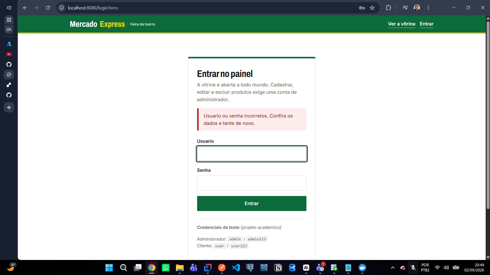

*Formulário de login próprio em `/login`, com a identidade visual do projeto no lugar da
tela padrão do Spring Security. O print mostra também o tratamento de credencial inválida:
depois de um envio incorreto o filtro redireciona para `/login?erro` e a página exibe
"Usuario ou senha incorretos", sem revelar qual dos dois campos falhou.*

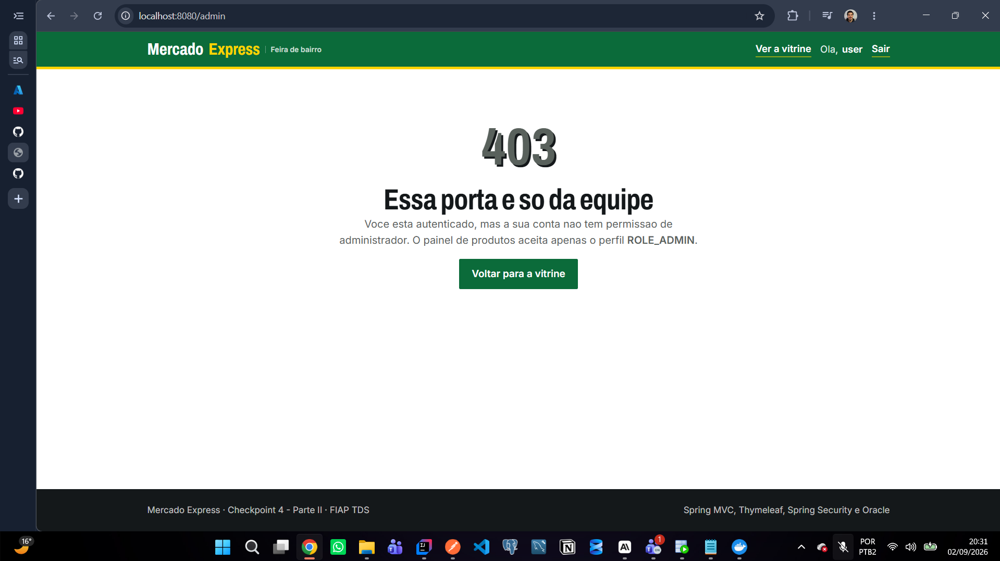

*Rota privada barrada: autenticado como `user` (veja "Ola, user" no cabeçalho), o acesso a
`/admin` cai na página **403** do projeto. O visitante continua logado — o que falta é a
permissão `ROLE_ADMIN`, não a autenticação.*

---

## 7. Modelo de dados

Tabela **`TDS_MVC_TB_MERCADO`**, própria da Parte II, no mesmo banco Oracle da Parte I.
As colunas herdadas da Parte I (nome, tipo, setor, tamanho e preço) foram mantidas e
enriquecidas com os campos que a interface web precisa exibir.

| Coluna | Tipo | Observação |
|---|---|---|
| `ID` | `NUMBER(10)` | PK, gerada por `TDS_MVC_SQ_MERCADO` |
| `NOME` | `VARCHAR2(100)` | Obrigatório |
| `TIPO` | `VARCHAR2(50)` | Obrigatório |
| `SETOR` | `VARCHAR2(50)` | Obrigatório; alimenta o filtro da vitrine |
| `TAMANHO` | `VARCHAR2(30)` | Opcional (`1kg`, `500ml`, `M`…) |
| `PRECO` | `NUMBER(10,2)` | Obrigatório, sempre `> 0` |
| `DESCRICAO` | `VARCHAR2(500)` | Texto da página de detalhe |
| `ESTOQUE` | `NUMBER(6)` | `>= 0`; zero marca o card como esgotado |
| `ATIVO` | `CHAR(1)` | `'S'` aparece na vitrine, `'N'` fica fora de linha |
| `DATA_CADASTRO` | `DATE` | Data de entrada na vitrine |

A entidade usa Lombok e mapeia a sequence com `allocationSize = 1`:

```java
@Entity
@Table(name = "TDS_MVC_TB_MERCADO")
@Getter @Setter @ToString
@NoArgsConstructor @AllArgsConstructor
@EqualsAndHashCode(onlyExplicitlyIncluded = true)
public class Produto {

    @Id
    @GeneratedValue(strategy = GenerationType.SEQUENCE, generator = "seqMercadoMvc")
    @SequenceGenerator(name = "seqMercadoMvc", sequenceName = "TDS_MVC_SQ_MERCADO", allocationSize = 1)
    @Column(name = "ID")
    @EqualsAndHashCode.Include
    private Long id;
    // ...
}
```

O campo `ativo` é um `Boolean` em Java e um `CHAR(1)` `'S'`/`'N'` no banco, traduzido por
um `AttributeConverter` (`SimNaoConverter`). A tabela continua legível para quem consulta
pelo SQL Developer.

### Script do banco

O arquivo [`database/script.sql`](database/script.sql) contém, nesta ordem: `DROP` da
tabela e da sequence, `CREATE TABLE` com as constraints, comentários de coluna, índices,
`CREATE SEQUENCE` e 13 `INSERT`s de exemplo (hortifruti, padaria, mercearia, bebidas,
limpeza, frios e bazar). Um dos produtos entra inativo de propósito, para evidenciar a
diferença entre o painel e a vitrine.

Execute-o no SQL Developer conectado com o seu usuário RM.

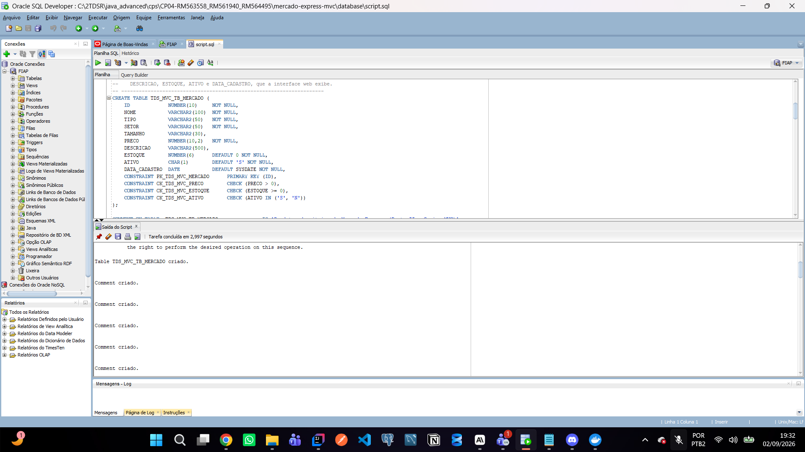

*Execução de `database/script.sql` no SQL Developer, conectado ao Oracle da FIAP: a saída
confirma "Table TDS_MVC_TB_MERCADO criado", com as constraints de preço, estoque e situação
(`ATIVO IN ('S','N')`) e os comentários de coluna.*

---

## 8. Como rodar localmente

### Pré-requisitos

- Java 21
- Maven (ou o wrapper `./mvnw`, já incluído)
- Acesso ao Oracle da FIAP — ou use o perfil `dev`, que não precisa de banco nenhum

### 8.1 Com o Oracle da FIAP

As credenciais **nunca** vão para o repositório: entram por variável de ambiente.
Copie `.env.example` para `.env` e preencha:

```env
DB_URL=jdbc:oracle:thin:@oracle.fiap.com.br:1521:ORCL
DB_USER=seu_rm
DB_PASSWORD=sua_senha
```

Depois exporte as variáveis e suba a aplicação:

```bash
# Windows (PowerShell)
$env:DB_USER="seu_rm"; $env:DB_PASSWORD="sua_senha"
./mvnw spring-boot:run

# Linux / macOS
export DB_USER=seu_rm DB_PASSWORD=sua_senha
./mvnw spring-boot:run
```

### 8.2 Sem banco nenhum (perfil `dev`, H2 em memória)

```bash
./mvnw spring-boot:run -Dspring-boot.run.profiles=dev
```

O Hibernate cria a tabela e a sequence, e `db/data-dev.sql` carrega os mesmos 13 produtos
de exemplo. Console do H2 em `http://localhost:8080/h2-console`.

### 8.3 Empacotando

```bash
./mvnw clean package
java -jar target/mercado-express-mvc-0.0.1-SNAPSHOT.jar --spring.profiles.active=dev
```

A aplicação sobe em **http://localhost:8080**.

> A Parte I (API REST) usa a porta **8082**, então as duas rodam ao mesmo tempo na
> mesma máquina sem conflito.

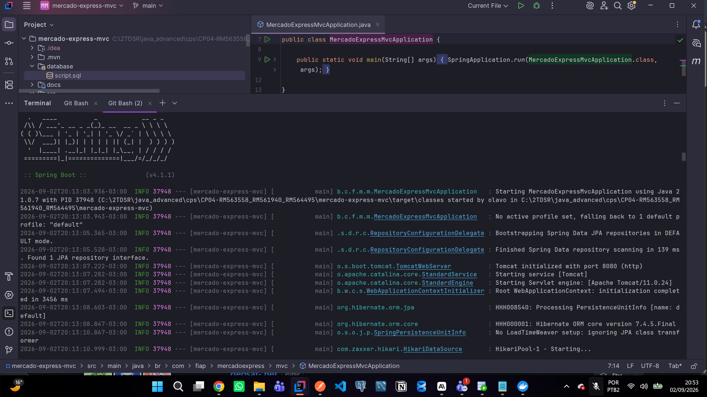

*Projeto aberto no **IntelliJ IDEA**, a IDE usada no desenvolvimento, com a aplicação
subindo pelo terminal integrado: Spring Boot 4.1.1, Java 21, perfil `default` (ou seja,
conectando no Oracle da FIAP) e o Tomcat inicializado na porta 8080.*

---

## 9. O CRUD na interface web

Todas as operações aparecem como **links e botões**, sem cliente HTTP nenhum.

### 9.1 READ público — a vitrine

`GET /` lista os produtos ativos em cards. O preço vem numa etiqueta amarela, o setor
identifica a gôndola e o estoque aparece como selo. A busca e o filtro de setor viajam na
URL (`/?busca=banana&setor=Hortifruti`), o que torna o resultado compartilhável.

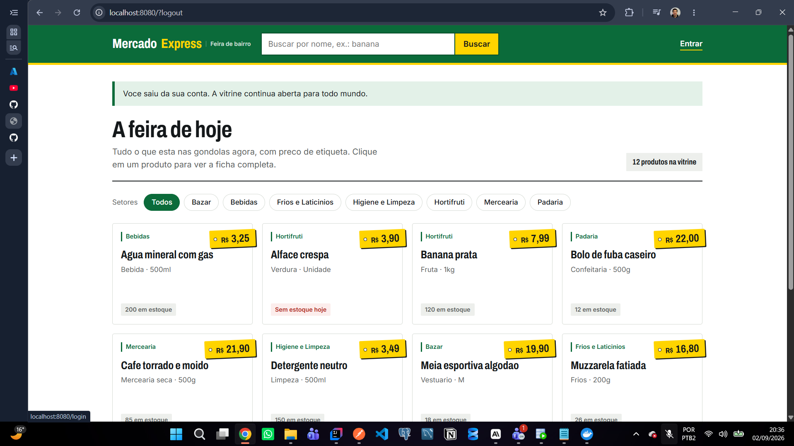

*Vitrine pública em `/`, sem nenhuma autenticação — repare no botão "Entrar" no canto
superior direito. Cada card traz o setor, o nome, tipo e tamanho, a etiqueta amarela de
preço e o selo de estoque (a alface aparece como "Sem estoque hoje"). Acima, os chips
filtram por setor e o contador mostra 12 produtos ativos.*

### 9.2 READ público — detalhe do produto

`GET /produtos/{id}` abre a ficha completa: descrição, preço em destaque, tipo, setor,
tamanho, estoque e data de cadastro.

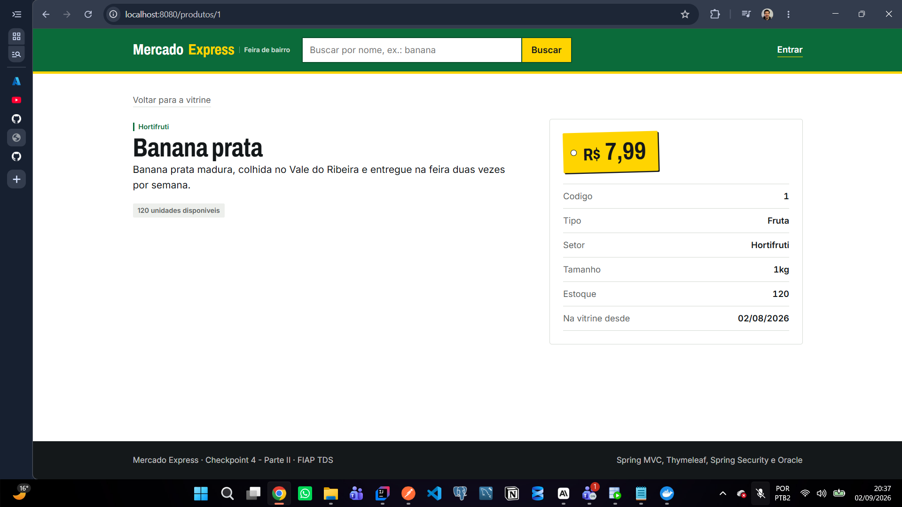

*Detalhe público em `/produtos/1`: descrição completa, preço em destaque na etiqueta e a
ficha técnica com código, tipo, setor, tamanho, estoque e data de cadastro.*

### 9.3 READ privado — o painel

`GET /admin` mostra **tabela densa**, não cards: o painel é ferramenta de trabalho, e ali
legibilidade e densidade valem mais que enfeite. Traz contadores de situação, busca,
filtro por setor e paginação com `Pageable` (10 por página).

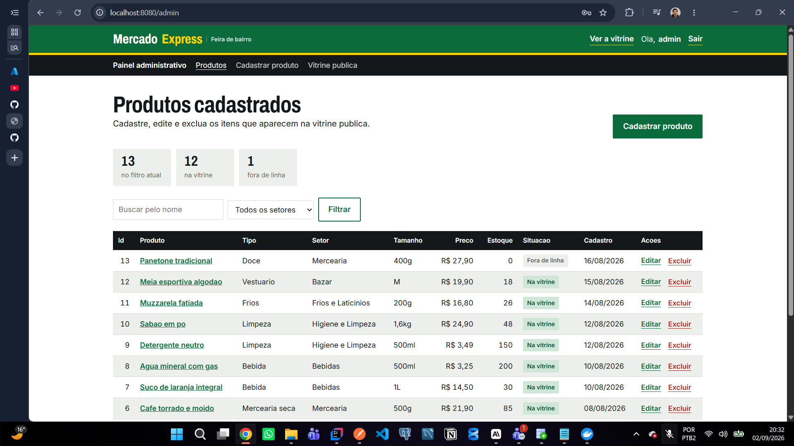

*Painel privado em `/admin`, já autenticado como `admin`. Tabela densa com todos os
produtos — inclusive o "Panetone tradicional", marcado como **Fora de linha** e por isso
ausente da vitrine. Cada linha traz os links **Editar** e **Excluir**, e no topo ficam os
contadores, a busca, o filtro por setor e o botão "Cadastrar produto".*

### 9.4 CREATE — cadastrar produto

`GET /admin/produtos/novo` abre o formulário; `POST /admin/produtos` grava. Ao terminar,
a aplicação redireciona para o painel com uma mensagem de sucesso via `RedirectAttributes`
(padrão *post-redirect-get*, que evita reenvio no F5).

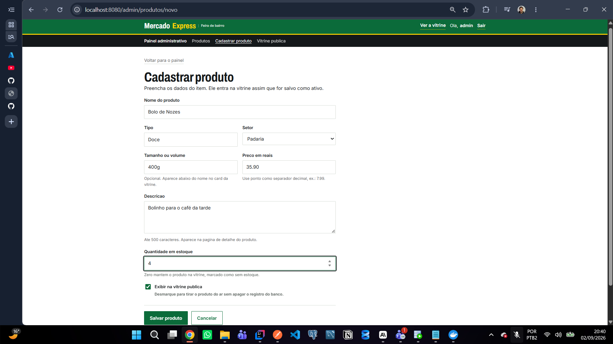

*Formulário de cadastro em `/admin/produtos/novo`, preenchido com o produto "Bolo de
Nozes". Coluna única, labels acima dos campos, textos de ajuda abaixo e o marcador
"Exibir na vitrine pública" controlando a coluna `ATIVO`.*

### 9.5 UPDATE — editar produto

`GET /admin/produtos/{id}/editar` reabre o **mesmo** formulário, agora preenchido;
`POST /admin/produtos/{id}` aplica a alteração. O service atualiza campo a campo,
preservando `ID` e `DATA_CADASTRO` originais.

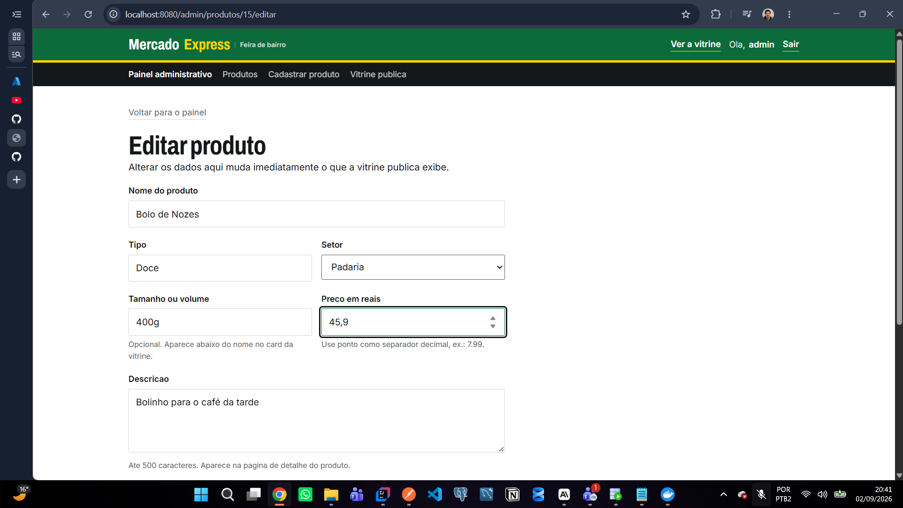

*O mesmo formulário reaberto em `/admin/produtos/15/editar`, já carregado com os dados
gravados. Aqui o preço está sendo alterado de 35.90 para 45,90.*

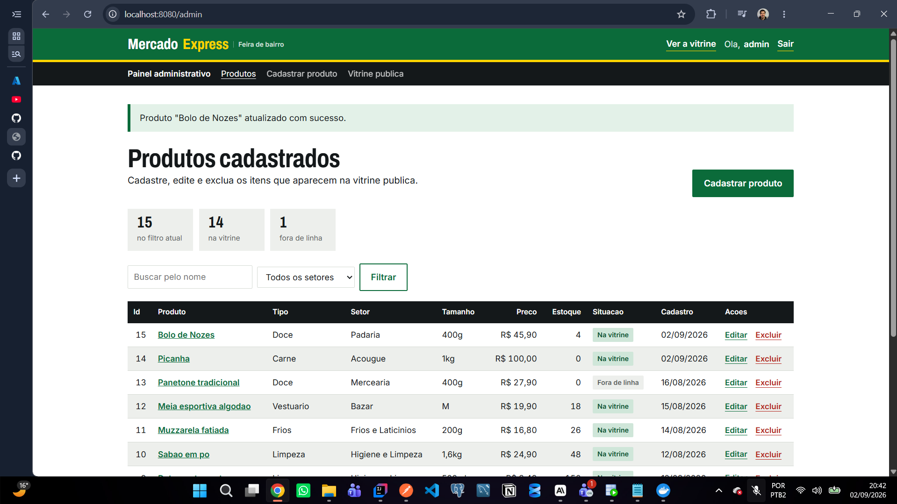

*Depois do `POST`, a aplicação redireciona para o painel e exibe a mensagem flash
`Produto "Bolo de Nozes" atualizado com sucesso.` — o padrão post-redirect-get, que evita
reenvio do formulário no F5. A linha 15 já mostra o preço novo, R$ 45,90.*

### 9.6 DELETE — excluir produto

O botão **Excluir** da linha envia um `POST` para `/admin/produtos/{id}/excluir`, depois
de uma confirmação no navegador. A ação é irreversível — por isso o botão é vermelho e
pergunta antes.

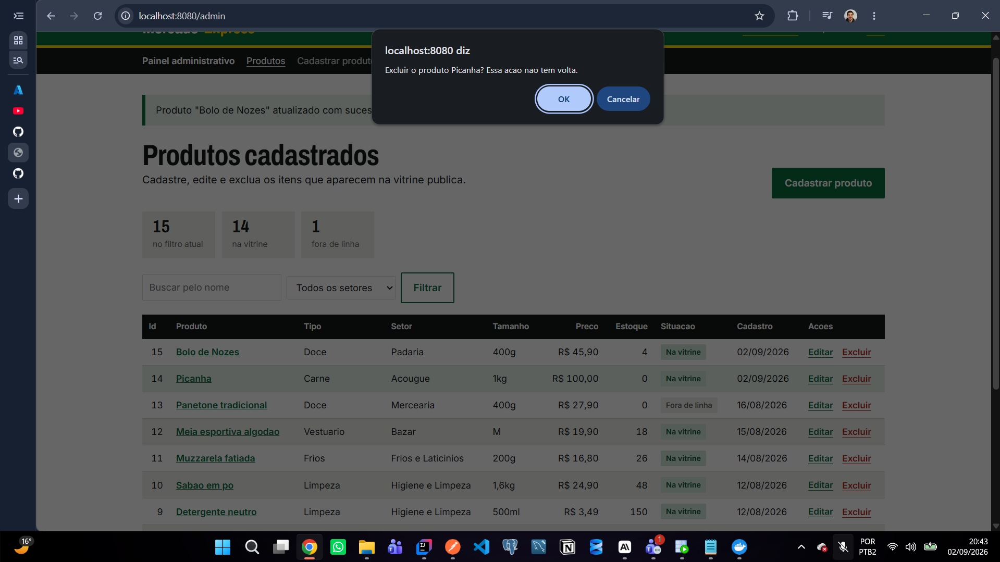

*Clique em **Excluir** na linha da "Picanha": antes de enviar o `POST`, o navegador pede
confirmação — "Excluir o produto Picanha? Essa acao nao tem volta." Cancelar aborta a
operação.*

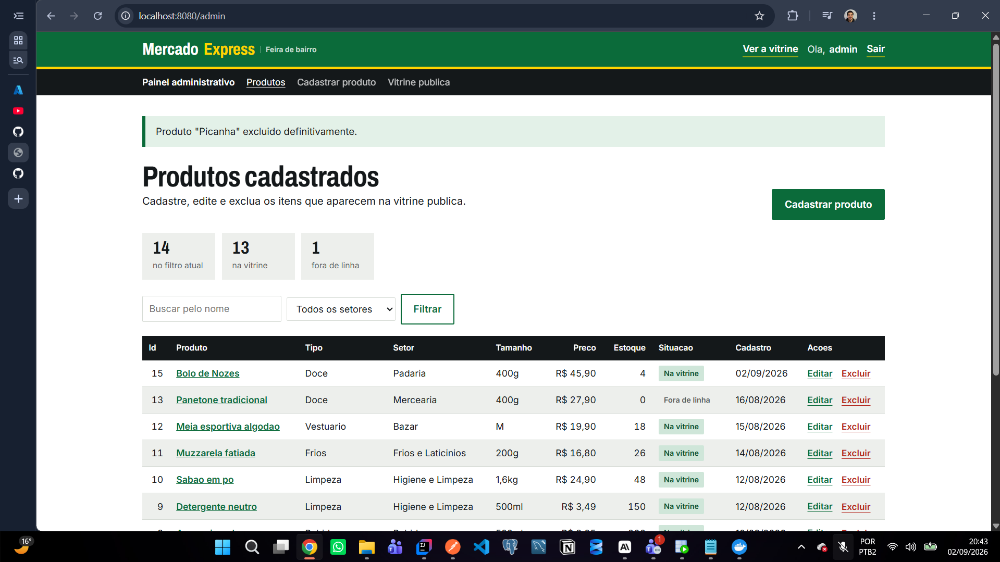

*Confirmada a exclusão, o painel volta com a mensagem `Produto "Picanha" excluido
definitivamente.` O registro sumiu da tabela e os contadores caíram de 15 para 14.*

> **Alternativa à exclusão:** desmarcar *"Exibir na vitrine pública"* no formulário tira
> o produto do ar sem apagar o registro do banco.

---

## 10. Validação de formulários

As regras ficam na própria entidade, com Bean Validation:

```java
@NotBlank(message = "Informe o nome do produto")
@Size(max = 100, message = "O nome pode ter no maximo 100 caracteres")
private String nome;

@NotNull(message = "Informe o preco")
@Positive(message = "O preco precisa ser maior que zero")
private BigDecimal preco;
```

O controller usa `@Valid` + `BindingResult`. Se houver erro, ele **devolve o próprio
formulário** com os dados digitados, em vez de deixar estourar uma exceção:

```java
@PostMapping("/produtos")
public String criar(@Valid @ModelAttribute("produto") Produto produto,
                    BindingResult erros, Model model, RedirectAttributes flash) {
    if (erros.hasErrors()) {
        model.addAttribute("edicao", false);
        return "admin/formulario";
    }
    // ...
}
```

No Thymeleaf, cada campo mostra a mensagem logo abaixo do input e ganha borda de alerta,
e um resumo no topo lista tudo o que precisa ser corrigido:

```html
<div class="campo" th:classappend="${#fields.hasErrors('nome')} ? 'campo--erro'">
    <label for="nome">Nome do produto</label>
    <input id="nome" type="text" th:field="*{nome}">
    <span class="campo__erro" th:if="${#fields.hasErrors('nome')}" th:errors="*{nome}"></span>
</div>
```

Nenhum erro de formulário chega ao Whitelabel. Id inexistente na URL também não:
`ProdutoNaoEncontradoException` é traduzida pelo `@ControllerAdvice` numa página 404 com
a identidade visual do projeto.

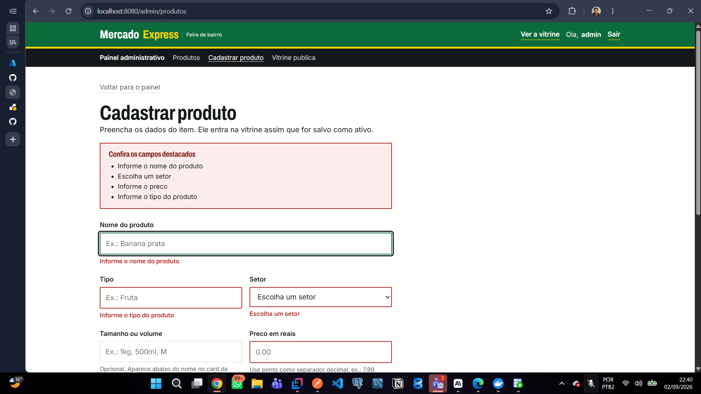

*Tentativa de salvar o formulário em branco: o `BindingResult` acusa erro, o controller
devolve a própria página e cada campo inválido ganha borda vermelha com a mensagem
abaixo, além do resumo no topo listando tudo o que precisa ser corrigido.*

---

## 11. Decisões de design

O layout é critério de nota, então ele foi tratado como parte do projeto, não como enfeite.

**Referência visual: sinalização de feira e etiqueta de preço de gôndola** — não dashboard
SaaS, não template genérico de admin.

**Paleta**, declarada como custom properties em `app.css`:

| Token | Cor | Uso |
|---|---|---|
| `--verde-folha` | `#0B6B3A` | Marca, cabeçalho, ações primárias |
| `--tinta` | `#14181A` | Texto e cabeçalho de tabela |
| `--papel` | `#FFFFFF` | Fundo |
| `--cinza-caixa` | `#EDEFEC` | Superfícies e linhas alternadas |
| `--amarelo-etiqueta` | `#FFD400` | **Exclusivo do preço** e destaques pontuais |
| `--alerta` | `#B3261E` | Erros e exclusão |

**Tipografia**, duas famílias via Google Fonts:
*Archivo* condensada (`font-stretch: 75%`) para títulos, preços e números — preço é o herói
visual, como numa etiqueta de gôndola, com `font-variant-numeric: tabular-nums` para os
dígitos alinharem em coluna. *Inter* para corpo e interface.

**Layout:** público em grade de cards, com a etiqueta amarela levemente inclinada
(`rotate(-2.5deg)`), furo de barbante e sombra sólida sem blur — papel sobre papel.
Admin em tabela densa com zebra e cabeçalho fixo. Formulários em coluna única de no
máximo 640px, com labels acima dos campos.

**Detalhes deliberados:** o raio de borda varia conforme o papel do elemento (cartão 4px,
controle 2px, chip pílula, tabela 0) em vez de ser o mesmo em tudo; não há gradiente
decorativo nem animação de entrada; a única transição é de cor, em 120ms.

**Acessibilidade:** responsivo até 375px, foco de teclado sempre visível (amarelo sobre as
faixas escuras), contraste conferido, link "pular para o conteúdo", `prefers-reduced-motion`
respeitado e estados vazios escritos como convite à ação, não como "nenhum registro
encontrado".

**CSS:** um único arquivo, sem framework. **Thymeleaf:** `th:fragment` para head, cabeçalho,
rodapé e paginação — nenhum HTML de estrutura é repetido entre as telas.

---

## 12. Deploy

Publicado no **Render**, a partir do `Dockerfile` multi-stage da raiz
(`maven:3.9-eclipse-temurin-21` compila, `eclipse-temurin:21-jre` executa).
O `render.yaml` declara as variáveis de ambiente com `sync: false`, então
`DB_URL`, `DB_USER` e `DB_PASSWORD` são preenchidas no painel do Render e nunca
ficam versionadas.

Como a aplicação roda atrás do proxy do Render, `application.properties` traz
`server.forward-headers-strategy=framework`, para que os redirects sejam gerados
com o host público e o esquema `https` corretos.

🔗 **Aplicação no ar:** https://mercadoexpress-mvc.onrender.com

> ⏱️ **Primeiro acesso demora.** O plano gratuito do Render hiberna o serviço após
> 15 minutos sem tráfego. A primeira requisição acorda o container e pode levar
> cerca de **50 segundos** para responder — depois disso a navegação é imediata.
> Se a página parecer travada, espere; ela carrega.

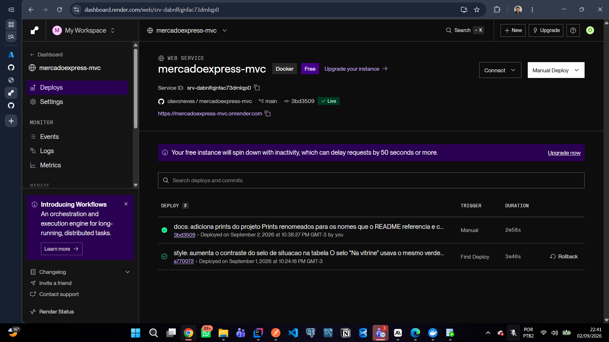

*Serviço `mercadoexpress-mvc` no painel do Render: runtime **Docker**, plano Free,
ligado ao repositório `olavoneves/mercadoexpress-mvc` na branch `main`, com status
**Live** e a URL pública. O histórico mostra os dois deploys já publicados, o mais recente
apontando para o commit no topo da `main`. O próprio painel avisa que a instância gratuita
hiberna e pode atrasar a primeira requisição em 50 segundos ou mais.*

---

## 13. Integrantes

| Nome | RM |
|---|---|
| Olavo Porto Neves | 563558 |
| Pedro Henrique França | 561940 |
| Luiz Gonçalves | 564495 |

**Turma:** 2TDSR · **Curso:** Análise e Desenvolvimento de Sistemas (TDS)
**IDE utilizada:** IntelliJ IDEA · **Deploy:** Render (Docker)

| Repositório | Link |
|---|---|
| Parte II — Spring MVC (este) | https://github.com/olavoneves/mercadoexpress-mvc |
| Parte I — API REST | https://github.com/olavoneves/mercadoexpress-api |

Os dados completos da equipe estão em [`integrantes.txt`](integrantes.txt).
